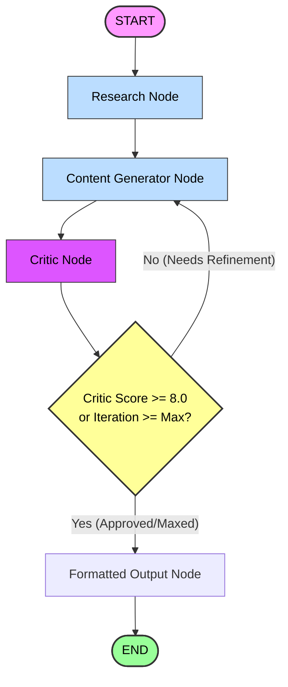

# 🤖 AI Content Publisher

An agentic, multi-agent AI poetry generation and publishing pipeline. This application leverages **LangGraph**, **LangChain**, and **Groq** to research ideas, draft engaging poems, critique and refine the drafts, and publish the final result directly to a Telegram channel—all controlled via an interactive Telegram bot.

---

## 📋 Project Overview

The **AI Content Publisher** is designed to generate high-quality, human-like poetry from simple prompts or random topics. Rather than using a single, static prompt, it orchestrates a network of specialized AI agents:
1. **Research Agent**: Extracts core themes, emotions, concrete imagery, and guidance from the topic.
2. **Writer Agent**: Transforms the research context into a cohesive poem, using iterative feedback to refine subsequent drafts.
3. **Critic Agent**: Reviews each draft against strict editorial guidelines, scoring it out of 10 and providing actionable feedback.

This loop repeats dynamically until the poem achieves a satisfactory score (8.0+) or hits the maximum iteration limit. Once generated, users can preview and publish the output to their Telegram channel with a single click.

---

## ✨ Features

* **Multi-Agent Orchestration**: Powered by LangGraph to manage complex state transitions and control flow across specialized agents.
* **Self-Correction & Refinement Loop**: Evaluates drafts using the Critic Agent and automatically rewrites content if it falls short of editorial standards (minimum score of 8.0/10).
* **Telegram Bot Interface**:
  * `/start`: Displays a rich welcome menu.
  * `/write <topic>`: Generates a poem based on a custom user-defined topic.
  * `/help`: Provides commands, guidelines, and user action explanations.
* **Interactive Inline Keyboards**:
  * **Publish**: Instantly posts the finalized content to your public/private Telegram channel.
  * **Regenerate**: Discards the current output and runs a fresh generation cycle.
  * **Cancel**: Discards the current draft.
* **Dynamic Topic Generation**: Generates original, creative poem prompts using a specialized LLM agent, replacing static topic pools.
* **Automated Publishing Scheduler**: Periodically runs the generation workflow and publishes a poem daily at 21:00 (Asia/Kolkata timezone) using APScheduler.
* **Structured Output Validation**: Enforces JSON outputs using LangChain and Pydantic models for absolute data schema compliance.

---

## 🏛️ Architecture

The project is structured modularly:

```
├── agents/             # Prompts & chains for specialized agents
│   ├── critic_agent.py
│   ├── research_agent.py
│   ├── topic_generator_agent.py
│   └── writer_agent.py
├── app/                # Configuration and global logger setup
│   ├── config.py
│   ├── logger.py
│   └── scheduler.py    # Daily automated workflow scheduling
├── graph/              # LangGraph workflow definition & state structure
│   ├── nodes.py        # Logic wrapper for state transitions
│   ├── state.py        # Pydantic schemas and TypedDict state definition
│   └── workflow.py     # Graph construction & conditional routing rules
├── prompts/            # Raw templates for agents
│   ├── critic.py
│   ├── research.py
│   ├── topic_generator.py
│   └── writer.py
├── telegram_bot/       # Telegram interfaces, handlers, and callbacks
│   ├── callbacks.py    # Inline button responses (Publish, Regenerate, Cancel)
│   ├── constants.py    # Key values
│   ├── handlers.py     # /start, /help, /write handlers
│   ├── keyboards.py    # Interactive UI button definitions
│   └── publisher.py    # Channel publication wrapper
├── tools/              # LLM wrapper configuration
│   └── llm.py
├── main.py             # Main entry point (starts the Telegram polling loop)
└── requirements.txt    # Dependency manifest
```

---

## 🔄 Workflow Diagram

Below is the execution graph managed by LangGraph. The pipeline begins when the user submits a topic or one is auto-selected:



### Routing Logic
1. The **Research Node** prepares conceptual information and imagery templates.
2. The **Content Generator Node** drafts a poem.
3. The **Critic Node** checks the poem on structure, originality, language, and imagery, giving a numeric score.
4. If `score < 8.0` and `iterations < MAX_ITERATIONS` (default: 3), the graph cycles back to the **Content Generator Node**, supplying it with the Critic's feedback and the previous draft.
5. If the poem meets the score threshold or max iterations are exceeded, the **Formatted Output Node** styles the text in HTML before ending the execution.
6. The interactive Telegram menu presents options to publish, regenerate, or cancel.

---

## 🛠️ Tech Stack

* **Core Pipeline**:   
* **LLM Engine**:  (Models: `llama-3.3-70b-versatile` & `llama-3.1-8b-instant`)
* **Bot Service**: 
* **Scheduling**: APScheduler (Advanced Python Scheduler)

---

## 🚀 Installation

Follow these steps to set up and run the bot locally:

### 1. Clone the Repository
```bash
git clone https://github.com/your-username/AI-content-publisher.git
cd AI-content-publisher
```

### 2. Set Up Virtual Environment
```bash
# Windows
python -m venv env
env\Scripts\activate

# Linux / macOS
python -m venv env
source env/bin/activate
```

### 3. Install Dependencies
```bash
pip install -r requirements.txt
```

### 4. Configure Environment Variables
Copy `.env.example` to `.env` and fill in your credentials (see [Environment Variables](#environment-variables)):
```bash
cp .env.example .env
```

### 5. Run the Application
```bash
python main.py
```

---

## 🔑 Environment Variables

The project reads configuration from a `.env` file in the root directory. Ensure the following variables are configured:

| Variable Name | Type | Description |
| :--- | :--- | :--- |
| `GROQ_API_KEY` | String | Your Groq Cloud API key. Get it from [Groq Console](https://console.groq.com). |
| `TELEGRAM_BOT_TOKEN` | String | The bot token generated by [@BotFather](https://t.me/BotFather) on Telegram. |
| `TELEGRAM_CHANNEL_ID` | String | The ID or handle (e.g., `@my_poetry_channel`) of the destination channel. |

---

## 🔮 Future Improvements

* **Active Web Search**: Integrate active search tools (such as Tavily or DuckDuckGo) to enrich the Research Agent's context with contemporary events and real-time facts.
* **Inline Draft Editing**: Allow users to make manual textual adjustments to the poem draft inside Telegram before hitting the publish button.
* **Multi-Platform Syndication**: Extend the publishing service to push content to other platforms like Medium, Substack, X/Twitter, and Discord.
* **Interactive Generation Configuration**: Add a settings menu (`/settings`) to customize writing styles (e.g., Haiku, Sonnet, Free Verse), model choices, and temperature directly from the bot interface.
* **Analytics Dashboard**: Store bot statistics and track channel engagement (likes, views, reactions) of published posts using a local database.
